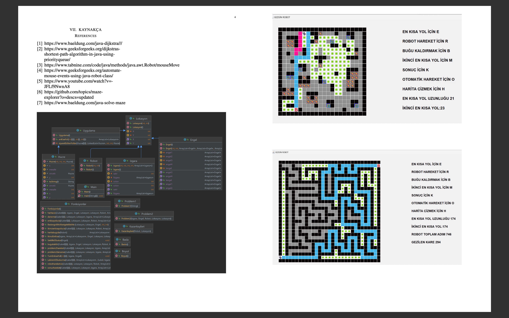

# PROJECT Travelling Robot Maze

## Project Description

Traveler Robot Project is a game that aims to help a robot, acting according to certain rules, reach its goal by overcoming the obstacles in front of it. Within the scope of the project, two problems need to be solved: In the first problem, the robot must reach the target in the shortest time by overcoming the obstacles on the grid, and in the second problem, the robot must reach the exit point in the maze. The project aims to reinforce knowledge of object-oriented programming and data structures and improve problem-solving skills. In the project developed using Java language, the robot's movements will be monitored step by step and the shortest path will be shown.
## Proje Amacı


The aim of this project is to reinforce knowledge of object-oriented programming and data structures and to develop problem-solving skills.
## Kullanılan Teknolojiler

- **Project Langueges:** Java
- **IDE:** IntelliJ IDEA
- 
## Setup

1. Clone this repository:
   ```bash
   git clone <https://github.com/lupsi12/traveling-robot-maze.git>



